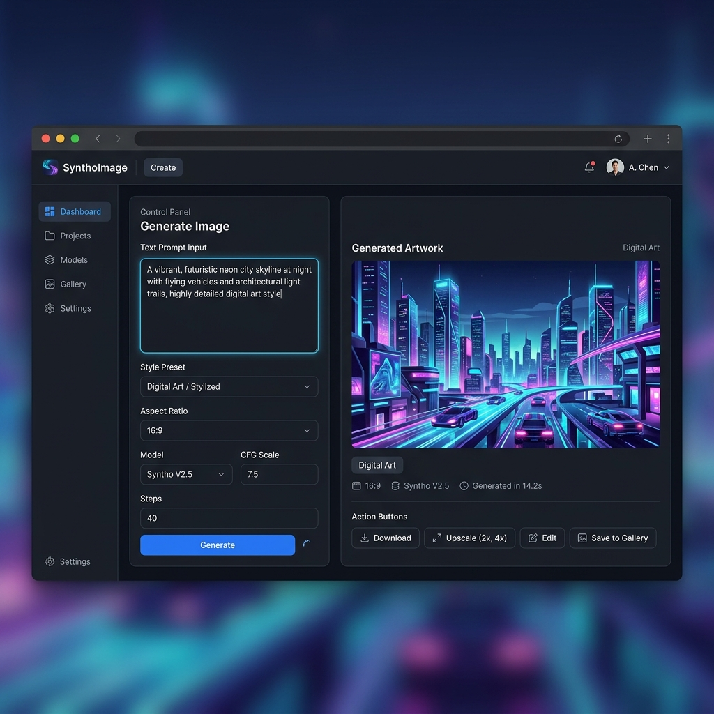

# 🌐 Piyush Bhardwaj - Portfolio Website

Welcome to my personal portfolio website! This project showcases my skills, projects, and experience as a **Full Stack Developer and AI Enthusiast**.

🔗 **Live Website:** https://piyushxbhardwaj.vercel.app  
💻 **GitHub Profile:** https://github.com/piyushxbhardwaj  

---

## 📌 About This Project

This is a modern, responsive portfolio website built using **HTML, CSS, and JavaScript**. It highlights my work in full-stack development, backend systems, and AI/ML projects.

---

## 🚀 Features

- 🌙 Modern dark UI with gradient design  
- 📱 Fully responsive (mobile + desktop)  
- ⚡ Smooth animations and scroll effects  
- 📂 Project filtering system  
- 📊 GitHub stats integration  
- 📄 Resume download option  
- 📬 Contact section with social links  

---

## 🛠️ Tech Stack

- **Frontend:** HTML5, CSS3, JavaScript  
- **Styling:** Custom CSS, Flexbox, Grid  
- **Tools:** Git, GitHub, VS Code  
- **Deployment:** Vercel  

---

## 📂 Featured Projects

### 🔹 PictoAI
AI-powered image generation platform using Stable Diffusion and Hugging Face  
- Built with React, Node.js, Flask, MongoDB  
- Real-time image generation  

### 🔹 Credit Card Fraud Detection
- Achieved **95% accuracy**  
- Reduced false positives by **15%**  
- Improved analysis speed by **40%**  

### 🔹 Order Creation API
- Built using Java & Spring Boot  
- Handles validation and high-volume requests  

### 🔹 EliteKicks E-commerce Website
- Responsive UI across devices  
- Improved load time by **30%**  

---

## 📸 Preview



---

## ⚙️ Installation & Setup

1. Clone the repository:
```bash
git clone https://github.com/piyushxbhardwaj/Portfolio-Website.git
