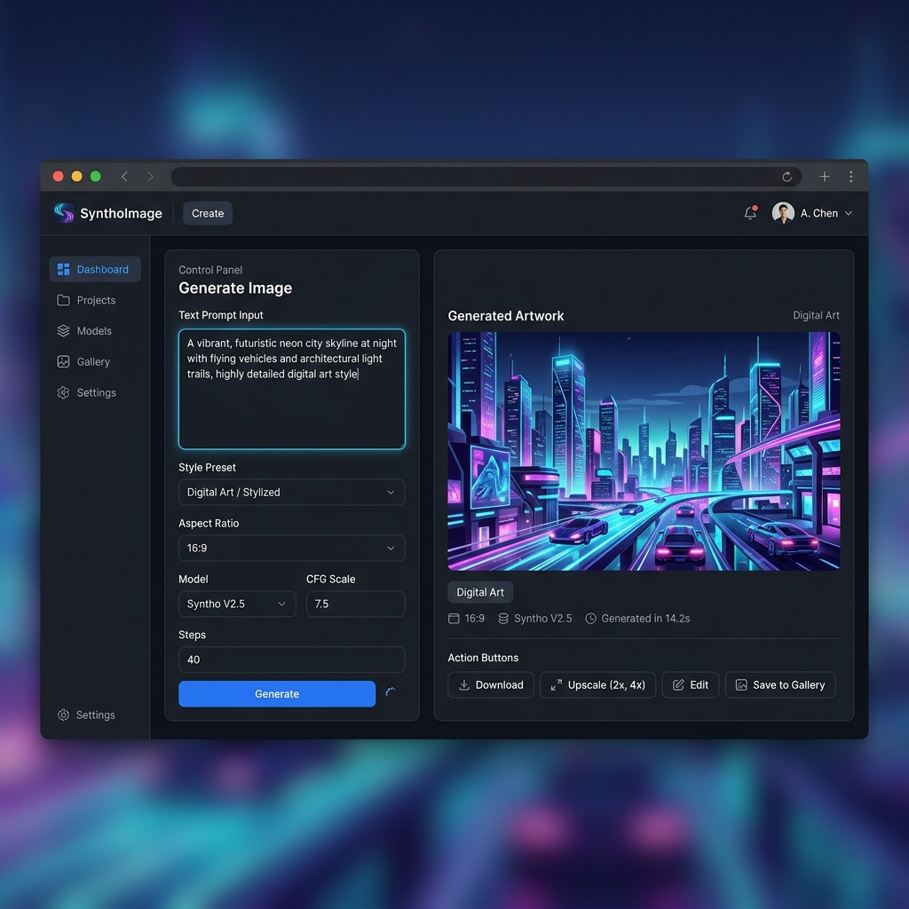

# 🌐 Piyush Bhardwaj - Portfolio Website

Welcome to my personal portfolio website! This project showcases my skills, projects, and experience as a **Full Stack Developer and AI Enthusiast**.

🔗 **Live Website:** https://piyushxbhardwaj.vercel.app  
💻 **GitHub Profile:** https://github.com/piyushxbhardwaj  

---

## 📌 About This Project

This is a modern, responsive portfolio website built using **HTML, CSS, and JavaScript**. It highlights my work in full-stack development, backend systems, and AI/ML projects.

---

## 🚀 Features

- 🌙 Modern dark UI with gradient design  
- 💼 Interactive Work Experience timeline  
- 📱 Fully responsive (mobile + desktop)  
- ⚡ Smooth animations and scroll effects  
- 📂 Project filtering system  
- 📊 GitHub stats integration  
- 📄 Dual role resume downloads (Software Engineering & AI/ML Engineering)  
- 📬 Contact section with social links  

---

## 🛠️ Tech Stack

- **Frontend:** HTML5, CSS3, JavaScript  
- **Styling:** Custom CSS, Flexbox, Grid  
- **Tools:** Git, GitHub, VS Code  
- **Deployment:** Vercel  

---

## 📂 Featured Projects

### 🤖 AgenticAI-RAG-Chatbot
Production-ready RAG chatbot built with LangGraph, FastAPI, Chroma/Pinecone, and OpenAI/Gemini for answering questions from an Agentic AI eBook.
- **Tech:** Python, LangGraph, FastAPI, ChromaDB, Pinecone, Gemini, OpenAI

### 📄 DeltaDocAI
AI-powered engineering document comparison with delta analysis, grounded RAG chat, OCR, and visual diff generation.
- **Tech:** React, Python, RAG, OCR, Computer Vision, PDF Processing

### ⚙️ AmosFlowAI
AI-powered GTM automation system using LangGraph, FastAPI, and Streamlit for company enrichment, personalized outreach, and CRM tracking.
- **Tech:** Python, LangGraph, FastAPI, Streamlit, CRM Automation, LLMs

### 🔍 InsightForge-AI
Production-grade AI Research Copilot built with React, FastAPI, LangGraph, and LangChain for automated company intelligence and meeting preparation.
- **Tech:** React, FastAPI, LangGraph, LangChain, RAG, TypeScript

### 📊 Sales Win/Loss Prediction
End-to-end Machine Learning pipeline for predicting sales opportunity win/loss using Random Forest, featuring EDA, preprocessing, and classification.
- **Tech:** Python, Random Forest, Scikit-Learn, Jupyter Notebook, Classification

### 🔔 AI Job Alert Bot
🤖 AI-powered job monitoring system that tracks software engineering and AI opportunities across job boards and sends real-time Telegram alerts.
- **Tech:** Python, Telegram API, Web Scraping, Automation

### 🚀 NovaTasks
Modern full-stack task management application with React, FastAPI, SQLite, and JWT Authentication.
- **Tech:** React, FastAPI, SQLite, JWT, JavaScript

### 📱 ReadTrack
Read-it-later iOS application built with SwiftUI, WKWebView, Share Extension, and intelligent reading-time synchronization.
- **Tech:** Swift, SwiftUI, iOS Xcode, WKWebView, Share Extension

### 🎨 PictoAI
AI-powered image generation platform featuring prompt caching, Razorpay payments, and multi-provider inference.
- **Tech:** React, Flask, MongoDB, Stable Diffusion, Razorpay, JWT

### 🔹 Context-Aware Document QA Bot
Production-quality Hybrid RAG system combining semantic retrieval and lexical search.
- **Tech:** Python, FastAPI, ChromaDB, BM25, Reciprocal Rank Fusion (RRF)

---

## 📸 Preview



---

## ⚙️ Installation & Setup

1. Clone the repository:
```bash
git clone https://github.com/piyushxbhardwaj/Portfolio-Website.git
```
